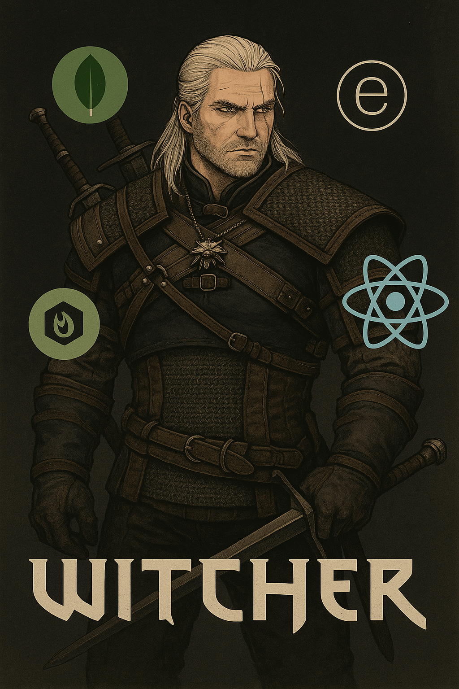

# ⚔️ Hexes, Monsters & Mayhem

<div align="center">

[](https://opensource.org/licenses/MIT)
[](https://github.com/404pandas/hmm/graphs/contributors)
[](https://github.com/404pandas/hmm/network/members)
[](https://github.com/404pandas/hmm/stargazers)
[](https://github.com/404pandas/hmm/issues)
[](https://linkedin.com/in/404pandas)

  <a href="https://github.com/404pandas/hmm">
    
  </a>

</div>

A dark fantasy monster-fighting game inspired by _The Witcher_, built using the MERN stack (MongoDB, Express, React, Node.js) with JWT-based authentication and GraphQL APIs.

## 📚 Table of Contents

- [🚀 Live Demo](#-live-demo)
- [🧰 Tech Stack](#-tech-stack)
- [📦 Installation](#-installation)
- [🗺️ Roadmap](#-roadmap)
- [🔐 Environment Variables (`.env`)](#-environment-variables-env)
- [📁 File Structure](#-file-structure)
- [🧙 Author](#-author)
- [🙏 Acknowledgements](#-acknowledgements)
- [📜 License](#-license)

## 🚀 Live Demo

> Coming soon...

---

## 🧰 Tech Stack


---

## 📦 Installation

```bash
git clone https://github.com/your-username/hexes-monsters-mayhem.git
cd hexes-monsters-mayhem
npm run install
npm run start:dev
```

Make sure MongoDB is running locally or provide a connection string in a `.env` file.

---

## 🗺️ Roadmap

### ✅ Phase 1: Project Setup

- [ ] Initialize project with `client/` and `server/` folders
- [ ] Add Vite + React + TypeScript on frontend
- [ ] Add Express + TypeScript + Apollo Server on backend
- [ ] Set up `package.json` scripts with `concurrently`, `wait-on`, and `nodemon`

### ✅ Phase 2: Basic Models & Auth

- [ ] Create `User` model (username, email, password)
- [ ] Create `Monster` model (name, type, health, attack, abilities, lore)
- [ ] Add JWT authentication (sign up, login, context-based auth)
- [ ] Hash passwords with bcrypt
- [ ] Protect GraphQL routes with middleware

### 🔨 Phase 3: GraphQL API

- [ ] Define typeDefs and resolvers for User and Monster
- [ ] Implement CRUD for Monsters
- [ ] Allow users to “own” monsters
- [ ] Add ability to battle monsters (phase 4)

### 🔮 Phase 4: Game Mechanics

- [ ] Build turn-based combat system
- [ ] Add monster stats (e.g. critical hit, elemental weakness)
- [ ] Implement battle history
- [ ] Add visual effects for attacks

### 🧙 Phase 5: Frontend Features

- [ ] Auth screens: Signup, Login
- [ ] Dashboard with list of owned monsters
- [ ] Monster detail page (lore, stats)
- [ ] Battle arena component (select 2 monsters to fight)

### 📈 Phase 6: Polish & Deployment

- [ ] Responsive UI with animations
- [ ] Add loading states and error handling
- [ ] Build client and deploy to Render/Netlify
- [ ] Deploy server to Render

---

## 🔐 Environment Variables (`.env`)

On the server:

```
MONGODB_URI=mongodb://localhost:27017/hmm_db
JWT_SECRET=your_jwt_secret
```

---

## 📁 File Structure

```
root/
├── client/         # React frontend (Vite, TS)
├── server/
│   ├── models/     # Mongoose models
│   ├── resolvers/  # GraphQL resolvers
│   ├── typeDefs/   # GraphQL schema
│   ├── auth/       # JWT utils & middleware
│   ├── seeds/      # Optional: seed DB
│   └── server.js   # Entry point
├── package.json
└── README.md
```

---

## 🧙 Author

Created by Mary Elenius  
🪄 [Portfolio](https://www.maryelenius.com)

---

## 🙏 Acknowledgements

- Witcher images and data inspired by [diwashrestha/WitcherAPI](https://github.com/diwashrestha/WitcherAPI). All content belongs to their respective copyright.

---

## 📜 License

This project is licensed under the MIT License.
